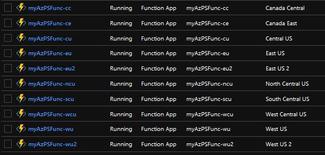

[Available on Terraform Module Registry](https://registry.terraform.io/modules/JustinGrote/azure-function-powershell/)

Deploys an opinionated Azure Functions Powershell infrastructure with intelligent defaults.

This was designed and tested for Powershell, however other workers _may_ work by setting the `azurerm_function_app_runtime` variable.
<!-- TOC -->

- [Requirements](#requirements)
- [Examples](#examples)
    - [Test Deployment](#test-deployment)
    - [Resilient Deployment](#resilient-deployment)
    - [Large Deployment](#large-deployment)
- [Features](#features)
    - [Built in Multi-Region Resiliency](#built-in-multi-region-resiliency)
    - [Low Idle Cost](#low-idle-cost)
    - [Traffic Manager Integration](#traffic-manager-integration)
    - [Key Vault Integration](#key-vault-integration)
    - [Workspace Support](#workspace-support)
    - [Unified Application Insights Workspace](#unified-application-insights-workspace)
    - [Optional Resources](#optional-resources)
    - [Global Tags](#global-tags)
    - [0.12 Features](#012-features)
    - [Autogenerated Storage Account Names](#autogenerated-storage-account-names)
- [FAQ](#faq)
- [Limitations](#limitations)

<!-- /TOC -->


# Requirements
* Terraform 0.12+
* (If using Azure Key Vault): Az CLI installed and available in PATH

# Examples
_Note_: These examples are additive and show the power of terraform. If you start with "Test Deployment" and then change it to "Large Deployment" and keep the same module name, Terraform will only implement the differences

## Test Deployment
Deploy a simple azure function app with no keyvault and no traffic manager

```hcl
#CHANGE THE MODULE NAME IN THIS EXAMPLE TO SOMETHING GLOBALLY UNIQUE IN AZURE
module "myAzPSFunc" {
  source  = "JustinGrote/azure-function-powershell/azurerm"
  azurerm_traffic_manager = false
  azurerm_key_vault = false
}
```
### Result


## Resilient Deployment
Deploy an azure function to two paired locations, and pre-populate some environment variables and azure keyvault secrets.
```hcl
#CHANGE THE MODULE NAME IN THIS EXAMPLE TO SOMETHING GLOBALLY UNIQUE IN AZURE
module "myAzPSFunc" {
  source  = "JustinGrote/azure-function-powershell/azurerm"
  location = [
    "west us 2",
    "west central us"
  ]
  azurerm_key_vault_secrets = {
    mysecret1 = "supersecret1"
    mysecret2 = "supersecret2"
  }
  app_settings = {
    mysetting1 = "secret1"
    mysetting2 = "secret2"
  }
}

output "azure_traffic_manager_fqdn" {
    module.myTestApp.azure_traffic_manager.fqdn
}
```

## Large Deployment
Deploy an Azure Function infrastructure to every Azure location in North America, using West Us 2 as the "global" location for traffic manager, etc.

```hcl
#CHANGE THE MODULE NAME IN THIS EXAMPLE TO SOMETHING GLOBALLY UNIQUE IN AZURE
module "myAzPSFunc" {
  source  = "JustinGrote/azure-function-powershell/azurerm"
  location = [
    "west us 2",
    "west us",
    "west central us",
    "central us",
    "north central us",
    "south central us",
    "east us",
    "east us 2"
    "canada central",
    "canada east",
  ]
}

output "azure_traffic_manager_fqdn" {
    module.myTestApp.azure_traffic_manager.fqdn
}
```
### Result
`azure_traffic_manager_fqdn = myazpsfunc.trafficmanager.net`



# Features

## Built in Multi-Region Resiliency
By specifying multiple locations to the location variable as a list, the function app will be set up in a best practice multi-site resiliency configuration. All you have to do is list what regions you want!

## Low Idle Cost
This module is designed to use consumption-based resources everywhere. The only "static" costs are a very minimal amount for the storage accounts, and $0.50 per month per region for the Azure Traffic Manager monitoring integration (which can be disabled)

## Traffic Manager Integration
By default this module will create an Azure Traffic Manager that will balance any requests to the traffic manager to the "closest" region by performance.

## Key Vault Integration
By default this module will create an Azure Key Vault for each function app and set up the appropriate rights to access it from the Azure Function.

## Workspace Support
If you are in a non-default terraform workspace, it will automatically append the workspace name to the resource names. For example, if you are in "dev" workspace, myfunction-westus becomes myfunction-westus-dev. Use the `name_suffix` variable to override this behavior by setting it to null or something else. This makes it possible to quickly create dev, test, and prod environments simply by changing the workspace and running an apply.

## Unified Application Insights Workspace
All defined function apps go to the same Application Insights workspace, providing a unified view of the performance of the function app as a whole.

## Optional Resources
If you just want a simple function app, you can disable the optional key vault, api gateway, and traffic manager components with the corresponding variables.

## Global Tags
By default the following tags get added:

* `TERRAFORM = "TRUE"`
* `TFWORKSPACE = "${terraform.workspace}"`

As well as any tags you specify with the `tags` variable.


## 0.12 Features
This module was written for 0.12, therefore it is a good example of several new features.

1. First order expressions
1. Using null in conditionals for optional devices
1. Using strong types and objects
1. Outputting entire object lists in outputs
1. Extensive use of locals and functions for input validation and intelligent defaults

## Autogenerated Storage Account Names
Storage Account and Traffic Manager names have strict requirements, so if your default naming scheme exceeds these requirements, this module will generate an appropriate shortname for you. No other input validation is done however.

---
# FAQ

### Why aren't the function app, key vault, etc. separate submodules?
Because module count and module for_each haven't been implemented in terraform yet. Once they are, these can be split out, but for now for the multi-region support and feature toggles to be simple, they have to all be one module.

### You sure repeat yourself a lot in this module, why isn't it DRY?
Because of the limitations of using count for the multiregion functionality. Locals aren't regenerated in a count loop, otherwise I would move that logic there. Have to wait for module for_each to be a thing. Aside from that, it is as DRY as possible using locals.

### Why all these resource groups, one per location plus a global one? Why not one resource group for my whole app?
Because https://docs.microsoft.com/en-us/azure/azure-resource-manager/resource-group-overview#resource-groups:

> If the resource group's region is temporarily unavailable, you can't update resources in the resource group because the metadata is unavailable. The resources in other regions will still function as expected, but you can't update them. To minimize risk, __locate your resource group and resources in the same region__.

This is the same reason we do a key vault per region, even though they "should" fail over due to a regional outage, this design doesn't take that chance. May make this an option in the future, but since key vaults are only billed on consumption, this makes little difference since terraform takes care of the deployment complexity.

---
# Limitations
1. __No SSL Certificate Support__ - If you enable the traffic manager, http requests will work fine, but if you want to use https with your functions you will get SSL warnings because for some dumb reason MS has decided that Azure Website certificates don't have the trafficmanager domain in them. I'm looking at some models to automatically distribute an SSL certificate for custom domains or use LetsEncrypt, but they are complex to implement in terraform and can probably more easily be done by a higher-level configuration management. I think its a reasonable thing to be in the terraform scope however. For now follow the normal manual instructions for installing a certificate for a traffic manager domain.
1. __No Azure Key Vault Application Settings Integration__ - Application Settings can be stored in Key Vault and referenced into App Settings. I may add this as an option but since Application Settings are encrypted at rest already, it makes little sense to do so until automatic key rotation is supported for this feature (not supported as of Q2 2019)
1. __No Function Distribution__ - This module lays the groundwork for azure functions, but actually deploying the code content is currently deemed out of scope of the module and is more suited to CI/CD processes like Azure Devops Pipelines or az deploy.
1. __No Slot Support__ - It may be possible to add slot support to "warm up" new function code 
1. __No API Gateway__ - For now if you need API gateway, you can bolt it on separately by taking the function app settings from the module output and creating them in a separate TF file.